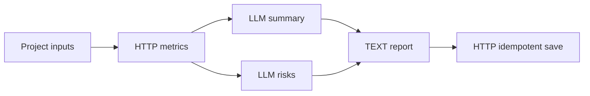

# FlowTrail Server

### Recoverable Java workflows with observable execution and safe restart handling

**Orchestrate TEXT, HTTP, and LLM nodes with JSON DAGs, then inspect parallel execution, model streams, and attempt history in a local web UI. Checkpoints, persistent event replay, and external-write reconciliation make recovery traceable.**

English | [中文](README_ZH.md)

[Quick Start](#quick-start) · [Report Demo](#report-demo) · [Features](#features) · [Documentation and Verification](#documentation-and-verification)


*Actual 0.2.0 web execution: a successful mock document summary with its node attempt and caught-up event stream. See the [full-page screenshot](docs/images/monitor-demo.jpg).*

Built with Java 21, Spring Boot, and Spring AI. Runs are persisted before background execution starts. Independent branches execute concurrently, and downstream nodes become eligible only after successful results are committed.

## Quick Start

Build from source with JDK 21+ and Maven 3.8.5+:

```sh
mvn clean verify
java -jar target/flowtrail-server.jar
```

Open **http://127.0.0.1:18081**. The default file-backed H2 database supports offline text workflows and explicitly labeled mock templates. Stream a summary without running additional services.

On Windows, use `start.bat` or `bin/start.ps1`; on Linux/macOS, use `sh bin/start.sh`. Launchers prefer `JAVA_HOME` and set the project working directory. The build creates `target/flowtrail-server-dist.zip`; the extracted package requires only JDK 21+. Run `start.bat -Check` to check the environment.

## Report Demo

Start the local report service in another terminal:

```sh
python scripts/mock_reports.py --port 18082 --database target/demo-reports.sqlite
```

Select the parallel business report mock template in the web UI, load it, validate it, and run it. The workflow fetches synthetic metrics, generates a summary and risks concurrently, combines them into a report, and saves it to a local service with an idempotency lookup protocol. The template is labeled mock; events and node execution come from the actual runtime.



Other templates cover document summaries, API data interpretation, and offline text. LLM nodes select `mock-demo` or `live-default` through `modelRef`. The Spring AI endpoint, model, and deployment version are fixed when a run is created; credentials come from environment variables, and errors are reported explicitly.

## Features

| Capability | Behavior |
| --- | --- |
| JSON DSL and DAG validation | Rejects duplicate IDs, cycles, unknown dependencies, non-ancestor references, and missing inputs before execution |
| Node registry | TEXT, HTTP, and LLM share an execution interface with immutable run inputs and ancestor-result snapshots |
| Bounded parallel execution | Defaults to 8 workers and 32 queued tasks per instance, with at most 4 submitted tasks per run |
| Failure and retry handling | Stops new successors while started tasks settle; retryable read-only failures receive at most two additional attempts |
| Checkpoints and takeover | Commits successful nodes incrementally; database-time leases and owner/epoch checks fence stale holders |
| External-write reconciliation | Freezes requests and stable keys; tracks PREPARED / UNKNOWN / CONFIRMED / DECLINED and looks up uncertain results by their original key |
| Persistent SSE | Persists events before delivery; supports run-local sequence IDs, Last-Event-ID replay, and model output separated by attempt |
| Web monitor | Provides templates, inputs, node and attempt results, streaming fragments, history, and explicit resume |

Interrupted LLM nodes regenerate in a new attempt; committed successful outputs are reused. A POST without a reliable reconciliation protocol enters `MANUAL_REVIEW`. A lease cannot retract an HTTP request already sent, and idempotency depends on the downstream service honoring its declared contract.

## Asynchronous API

```powershell
$base = 'http://127.0.0.1:18081'
$definition = Get-Content examples/hello-workflow.json -Raw -Encoding UTF8
$workflow = Invoke-RestMethod "$base/api/workflows" -Method Post -ContentType 'application/json; charset=utf-8' -Body ([Text.Encoding]::UTF8.GetBytes($definition))
$body = Get-Content examples/run-inputs.json -Raw -Encoding UTF8
$run = Invoke-RestMethod "$base/api/workflows/$($workflow.id)/runs" -Method Post -Headers @{'Idempotency-Key'='hello-demo-1'} -ContentType 'application/json; charset=utf-8' -Body ([Text.Encoding]::UTF8.GetBytes($body))
Invoke-RestMethod "$base/api/runs/$($run.id)"
```

Run creation returns **202 Accepted + Run** and a `Location` header. Within a workflow, the same key and inputs return the existing run; changed inputs return 409. Poll or use SSE to wait for a terminal status. This changes the synchronous response behavior of 0.1; see the [migration guide](docs/migration-0.2.md) and [API reference](docs/api.md).

## MySQL and Configuration

The default H2 path is `./data/flowtrail-runtime-v2`; the previous `./data/flowtrail` database is preserved. MySQL tables are managed with Flyway:

```powershell
$env:FLOWTRAIL_DB_PASSWORD = 'replace-with-a-local-password'
docker compose up -d mysql
$env:SPRING_PROFILES_ACTIVE = 'mysql'
$env:FLOWTRAIL_DB_URL = 'jdbc:mysql://127.0.0.1:13306/flowtrail_runtime?connectionTimeZone=UTC&forceConnectionTimeZoneToSession=true'
$env:FLOWTRAIL_DB_USER = 'flowtrail'
java -jar target/flowtrail-server.jar
```

| Environment variable | Purpose or default |
| --- | --- |
| `SERVER_ADDRESS` / `SERVER_PORT` | `127.0.0.1` / `18081` |
| `FLOWTRAIL_DB_URL` / `FLOWTRAIL_DB_USER` / `FLOWTRAIL_DB_PASSWORD` | JDBC connection settings |
| `FLOWTRAIL_MODEL_BASE_URL` | OpenAI-compatible endpoint |
| `FLOWTRAIL_MODEL_NAME` / `FLOWTRAIL_MODEL_VERSION` | Model and deployment version |
| `FLOWTRAIL_MODEL_API_KEY` | Deployment credential; excluded from the DSL, events, and configuration snapshots |

`.env.example` documents configuration and is not loaded automatically by the launchers. Local data, runtime state, and build logs are excluded from version control. The server listens on localhost by default. It currently has no authentication or tenant isolation and accepts trusted workflow definitions.

## Documentation and Verification

The complete local 0.2.0 verification passed **48 Maven tests**, 7 web-state regression tests, and 5 report-service HTTP tests. The final JAR passed five recovery scenarios on MySQL, including two that forcibly terminated and restarted the Java process. These cover committed-checkpoint reuse, model-attempt isolation, SSE replay, and external-write reconciliation after a lost response. Environment and results are recorded in the [verification report](docs/verification-0.2.md).

```sh
mvn clean verify
python scripts/collect_licenses.py --check
python scripts/smoke.py
python scripts/recovery_smoke.py
python -m unittest discover -s scripts -p test_mock_reports.py
node --test scripts/ui-state.test.cjs scripts/ui-replay.test.cjs
```

The license check compares every recorded runtime dependency and its original license/notice bytes with the built JAR. Git preserves `licenses/` without changing line endings.

MySQL JUnit tests use `FLOWTRAIL_TEST_MYSQL_URL / USER / PASSWORD`. For process recovery tests, set `FLOWTRAIL_TEST_DB_URL / USER / PASSWORD` and add `--mysql`; the isolated database must be local and its name must end in `_test`.

- [Durable runtime implementation](docs/runtime-implementation.md)
- [API reference](docs/api.md) and [migration guide](docs/migration-0.2.md)
- [Project capabilities and evidence](docs/resume-evidence.md)
- [Local verification report](docs/verification-0.2.md) and [changelog](CHANGELOG.md)

The linked implementation documents are currently in Chinese.

## License and Attribution

The initial version was implemented with assistance from an AI coding assistant. The design and demonstrations can be reproduced from the source code and recorded procedures above.

Project code is licensed under [MIT](LICENSE). Dependencies retain their own licenses; see [THIRD_PARTY_NOTICES.md](THIRD_PARTY_NOTICES.md).
