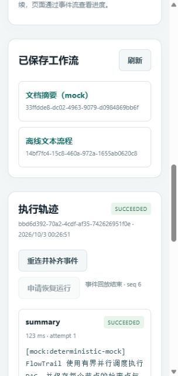
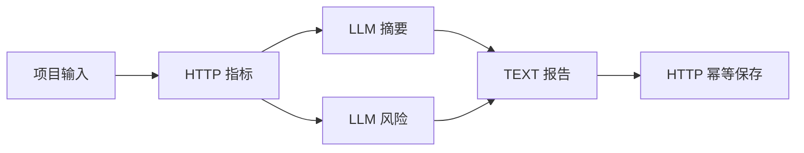

# FlowTrail Server

### 可恢复的 Java 工作流服务，让每一步执行都有迹可循

**通过 JSON DAG 编排 TEXT、HTTP 和 LLM 节点，在网页中查看并行执行、模型片段和尝试历史。检查点、持久化事件重放与外部写核查，让中断后的恢复有据可查。**

[English](README.md) | 中文

[快速开始](#快速开始) · [业务报告演示](#业务报告演示) · [已实现能力](#已实现能力) · [文档与验证](#文档与验证)



*0.2.0 实际网页运行：mock 文档摘要成功，展示节点尝试与已追平的事件。另见[完整页面截图](docs/images/monitor-demo.jpg)。*

基于 Java 21、Spring Boot 和 Spring AI，支持有界并行、持久化 SSE、MySQL 检查点和外部写幂等核查。运行先持久化，再由后台执行；独立分支并行处理，节点成功提交后才释放后继依赖。

## 快速开始

源码构建需要 JDK 21+、Maven 3.8.5+：

```sh
mvn clean verify
java -jar target/flowtrail-server.jar
```

打开 **http://127.0.0.1:18081**。默认 H2 文件数据库支持离线文本和显式 mock 模板；无需额外服务即可查看摘要的流式执行。

Windows 可双击 `start.bat`，或运行 `bin/start.ps1`；Linux/macOS 使用 `sh bin/start.sh`。启动器优先使用 `JAVA_HOME` 并固定项目工作目录。构建产生 `target/flowtrail-server-dist.zip`，解压后只需 JDK 21+。`start.bat -Check` 可检查环境。

## 业务报告演示

另一个终端启动本地报告服务：

```sh
python scripts/mock_reports.py --port 18082 --database target/demo-reports.sqlite
```

页面选择“并行生成业务报告（mock）”，载入模板、校验并运行。流程获取模拟指标，并行生成摘要和风险，汇总报告后写入提供幂等查询协议的本地服务。页面明确显示 mock 模板，事件与节点执行来自实际运行时。



另外提供文档摘要、接口数据解读和离线文本模板。LLM 使用 `modelRef` 选择 `mock-demo` 或 `live-default`；Spring AI 调用的地址、模型与版本在创建时固定，凭据通过环境变量获取，错误明确返回。

## 已实现能力

| 能力 | 行为 |
| --- | --- |
| JSON DSL 与 DAG | 运行前拒绝重复 ID、环、未知依赖、非祖先引用和缺失输入 |
| 节点注册表 | TEXT、HTTP、LLM 共享执行接口，不可变运行输入与祖先结果快照 |
| 有界并行 | 每实例默认 8 个工作线程、32 个等待任务，每运行最多 4 个投递任务 |
| 失败与重试 | 停止新后继，已启动任务真实收敛；只读可重试错误最多再试两次 |
| 检查点与接管 | 成功节点逐步提交；数据库时间租约、owner/epoch 校验阻止旧持有者写回 |
| 外部写核查 | 冻结请求、稳定键、PREPARED / UNKNOWN / CONFIRMED / DECLINED；结果不明先按原键查询 |
| SSE | 事件先持久化；运行内序号、Last-Event-ID 重放、按 attempt 区分模型输出 |
| 网页 | 模板、输入、节点与尝试结果、流式片段、历史和显式恢复 |

LLM 中断后创建新 attempt 重新生成，成功输出直接复用。POST 无可靠核查协议时进入 `MANUAL_REVIEW`；租约不撤回已经发送的 HTTP 请求。幂等语义依赖下游实际遵守声明契约。

## 异步 API

```powershell
$base = 'http://127.0.0.1:18081'
$definition = Get-Content examples/hello-workflow.json -Raw -Encoding UTF8
$workflow = Invoke-RestMethod "$base/api/workflows" -Method Post -ContentType 'application/json; charset=utf-8' -Body ([Text.Encoding]::UTF8.GetBytes($definition))
$body = Get-Content examples/run-inputs.json -Raw -Encoding UTF8
$run = Invoke-RestMethod "$base/api/workflows/$($workflow.id)/runs" -Method Post -Headers @{'Idempotency-Key'='hello-demo-1'} -ContentType 'application/json; charset=utf-8' -Body ([Text.Encoding]::UTF8.GetBytes($body))
Invoke-RestMethod "$base/api/runs/$($run.id)"
```

创建运行返回 **202 Accepted + Run**，并设置 `Location`。同工作流的同键同参返回原运行，异参返回 409。通过查询或 SSE 等待终态。0.1 的同步返回语义已变更，见 [迁移说明](docs/migration-0.2.md) 与 [API](docs/api.md)。

## MySQL 与配置

默认 H2 路径为 `./data/flowtrail-runtime-v2`，旧 `./data/flowtrail` 不会被覆盖。MySQL 使用 Flyway 建表：

```powershell
$env:FLOWTRAIL_DB_PASSWORD = 'replace-with-a-local-password'
docker compose up -d mysql
$env:SPRING_PROFILES_ACTIVE = 'mysql'
$env:FLOWTRAIL_DB_URL = 'jdbc:mysql://127.0.0.1:13306/flowtrail_runtime?connectionTimeZone=UTC&forceConnectionTimeZoneToSession=true'
$env:FLOWTRAIL_DB_USER = 'flowtrail'
java -jar target/flowtrail-server.jar
```

| 环境变量 | 用途或默认 |
| --- | --- |
| `SERVER_ADDRESS` / `SERVER_PORT` | `127.0.0.1` / `18081` |
| `FLOWTRAIL_DB_URL` / `FLOWTRAIL_DB_USER` / `FLOWTRAIL_DB_PASSWORD` | JDBC 连接配置 |
| `FLOWTRAIL_MODEL_BASE_URL` | OpenAI 兼容服务地址 |
| `FLOWTRAIL_MODEL_NAME` / `FLOWTRAIL_MODEL_VERSION` | 模型与部署版本 |
| `FLOWTRAIL_MODEL_API_KEY` | 部署凭据，不进入 DSL、事件或配置快照 |

`.env.example` 为说明文件，启动器不会自动加载。`data/`、本地状态与构建日志不进入版本管理。服务默认只监听本机，当前没有认证和租户隔离；执行器接受可信工作流定义。

## 文档与验证

0.2.0 本地完整验收通过 **48 项 Maven 测试**、7 项网页回归和 5 项报告服务 HTTP 测试。最终 JAR 在 MySQL 上通过五组恢复场景，其中两组真实强杀并重启 Java 进程；覆盖成功检查点复用、模型尝试隔离、SSE 重放和响应丢失后的外部写核查。完整环境与结果见[验证记录](docs/verification-0.2.md)。

```sh
mvn clean verify
python scripts/smoke.py
python scripts/recovery_smoke.py
python -m unittest discover -s scripts -p test_mock_reports.py
node --test scripts/ui-state.test.cjs scripts/ui-replay.test.cjs
```

MySQL JUnit 设置 `FLOWTRAIL_TEST_MYSQL_URL / USER / PASSWORD`。真实进程恢复脚本使用独立测试库，设置 `FLOWTRAIL_TEST_DB_URL / USER / PASSWORD` 后加 `--mysql`；库名必须以 `_test` 结尾并位于本机。

- [持久化运行时](docs/runtime-implementation.md)
- [API](docs/api.md)与[迁移说明](docs/migration-0.2.md)
- [简历能力与证据](docs/resume-evidence.md)
- [本地验证记录](docs/verification-0.2.md)与[更新记录](CHANGELOG.md)

## 许可与来源

初始版本在 AI 编程助手协助下实现，设计解释与演示可从上述代码和操作记录复现。

代码采用 [MIT](LICENSE)，依赖保留各自许可，见 [THIRD_PARTY_NOTICES.md](THIRD_PARTY_NOTICES.md)。
